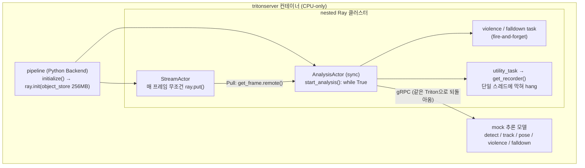
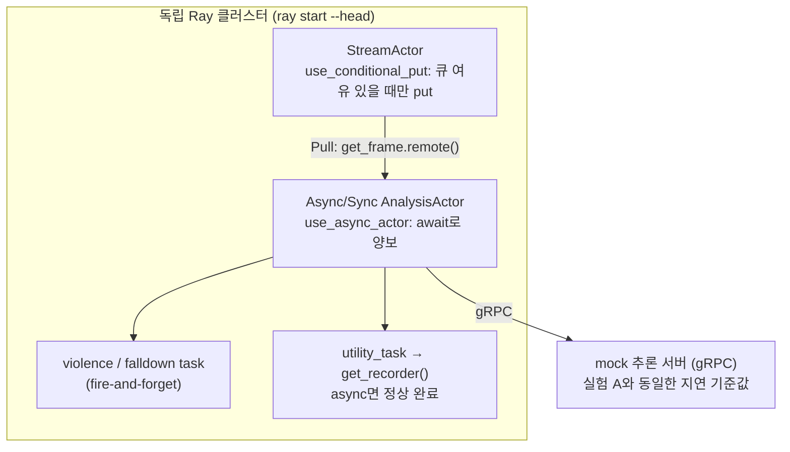

# Ray Nested vs Standalone 벤치마크

Triton Python Backend **안에서** Ray를 nested로 기동한 CCTV 분석 파이프라인의 성능 병목을,
회사 코드 없이 합성 워크로드로 재현하고, Ray를 독립(standalone)으로 분리한 재설계의 개선 효과를
수치로 검증하는 포트폴리오 프로젝트입니다.

---

## 1. 요약

원 시스템은 실시간 CCTV 영상 분석 파이프라인으로, 분석 로직이 Triton Inference Server의 Python
Backend(Stub Process) 안에서 실행되고 **그 안에서 다시 Ray 클러스터를 초기화**하는 nested 구조
였습니다. 이 구조에서 부하가 오를수록 end-to-end 지연이 지속 상승하고, 분석 Actor의 CPU가 주기적
으로 0%로 떨어지며, Ray Object Spilling이 누적되는 문제가 관찰되었습니다.

이 레포는 그 병목을 두 실험으로 나눠 검증합니다.

- **실험 A (nested)**: 실제 tritonserver의 Python Backend 안에서 Ray를 nested로 기동해 원 시스템
  구조를 재현합니다.
- **실험 B (standalone)**: 동일 파이프라인을 독립 Ray 클러스터에서 실행하고, 개선 항목 6종을
  개별 플래그로 켜고 끄며 기여도를 분해 측정합니다.

핵심 결과: 동일 워크로드에서 **nested(A)는 약 86초 만에 계측 붕괴로 측정이 종단**된 반면,
**standalone은 개선 이전(B0)에도 600초를 완주**했고 개선 6종을 모두 켠 B-all에서는 spill 로그가
122건에서 5건으로 줄고 처리 프레임 수가 약 2.5배가 되었습니다. (세부 지연 수치는 실측 자리표시자.)

---

## 2. 문제

원 시스템에서 식별된 12개 문제 중, 성능에 직접 영향을 주는 8개를 재현 대상으로 삼았습니다.
(상세 분석: [`docs/01-problem-analysis.md`](docs/01-problem-analysis.md))

| # | 범주 | 문제 | 심각도 |
|---|------|------|--------|
| 1 | 구조 | Stub + Ray 중첩 → CPU 경합/스케줄링 지연/캐시 오염/메모리 이중복사 | Critical |
| 2 | 구조 | Object Spilling → Memory Thrashing → 분석 Actor 기아 | Critical |
| 3 | 프레임 경로 | 매 프레임 Pull IPC (Raylet 왕복 2회) | High |
| 4 | 프레임 경로 | 버려지는 프레임도 ray.put() | Medium |
| 5 | 프레임 경로 | 직렬 동기 gRPC 3회 (의존성 체인) | High |
| 6 | 프레임 경로 | np.append() O(N) 재할당 | Medium |
| 7 | 이벤트 경로 | np.object_ SerDes → 대용량 pickle | High |
| 8 | 이벤트 경로 | get_recorder 태스크 기아 (무한 연기) | High |

문제 9~12는 코드 품질 이슈로 성능 벤치마크와 무관하여 범위 밖입니다.

---

## 3. 가설

1. **문제 1은 Ray의 결함이 아니라 nested 구조의 결함이다.** Stub Process를 제거하고 Ray를
   standalone으로 기동하면 CPU 경합·캐시 오염·SHM↔Plasma 이중복사의 4단계 악순환이 함께
   소멸한다.
2. **문제 2~8은 각각 독립적으로 개선 가능하다.** deque recorder, ObjectRef 저장, 조건부 put,
   async Actor, object_store 명시 설정으로 개별 분해해 기여도를 측정할 수 있다.
3. **구조 전환과 개별 개선은 서로 다른 축이다.** 구조 전환(B0)이 붕괴를 막고, 개별 개선(B-all)이
   그 위에서 자원 낭비를 걷어내 처리량을 끌어올린다.

가설을 실험으로 매핑한 설계 근거는 [`docs/02-experiment-design.md`](docs/02-experiment-design.md)에
있습니다.

---

## 4. 설계

두 실험은 파이프라인 스테이지·계측·추론 지연 기준값을 **동일 모듈에서 공유**합니다. 차이는 Ray
기동 구조와 실험 B의 개선 플래그뿐입니다("구조 차이 외 변수" 제거).

### 실험 A — nested 구조



분석 Actor가 자기가 사는 Triton으로 gRPC를 되돌려 호출하는 루프, sync Actor의 무한 루프에 막혀
hang되는 `get_recorder`, 좁게 잡은 object_store로 유도되는 Spilling이 이 구조에 모두 담깁니다.

### 실험 B — standalone 구조



개선 플래그 6종(전부 off = B0 = nested와 동일 로직, 전부 on = B-all):

| 플래그 | 대상 문제 | 효과 |
|--------|----------|------|
| `use_deque_recorder` | 6 | np.append → deque(maxlen) |
| `use_objectref_recorder` | 7 | 프레임 원본 → ObjectRef 저장 |
| `use_conditional_put` | 4 | 무조건 put → 큐 여유 시만 put |
| `use_async_actor` | 8 | sync 무한루프 → async + await |
| `explicit_object_store` | 2 | object_store_memory 명시 |
| `set_cpu_affinity` | (구조 가설) | 프로세스별 코어 고정 (A/B 공용) |

---

## 5. 결과

**구체적인 지연 수치(P50/P99 등)는 실측 자리표시자**이며, 아래에서 확정하는 것은 완주 여부·spill
로그 건수·상대 처리량처럼 실측으로 확인된 사실뿐입니다. (상세: [`docs/03-results.md`](docs/03-results.md))

| 지표 | A (nested) | B0 (standalone) | B-all (standalone) |
|------|-----------|-----------------|--------------------|
| 완주 여부 | 약 86초 측정 종단 | 600초 완주 | 600초 완주 |
| e2e P50 | 3.2s → 4.9s 상승 후 종단 | *(실측 기입)* | *(실측 기입)* |
| e2e P99 | *(실측 기입)* | *(실측 기입)* | *(실측 기입)* |
| 분석 Actor CPU | 샘플 60%가 <1% | *(실측 기입)* | *(실측 기입)* |
| spill 로그 건수 | 다수 | 122건 | 5건 |
| 처리 프레임 수 (상대) | — | 1.0× (기준) | 약 2.5× |

<!-- TODO: 작업자 실측 기입 — 위 표의 *(실측 기입)* 칸을 docs/data/ CSV로 채운다 -->


<!-- TODO: 그래프 PNG는 analysis/ 스크립트가 docs/data/의 CSV로부터 docs/img/에 생성 -->

---

## 6. 결론

- **구조 전환이 가장 큰 변수였습니다.** nested(A)는 86초 만에 측정이 불가능해진 반면 standalone은
  개선 이전(B0)에도 600초를 완주했습니다. 문제 1의 제거만으로 파이프라인이 붕괴에서 완주로
  바뀌었고, 이는 "Ray가 아니라 nested 구조가 문제였다"는 가설을 지지합니다.
- **개별 개선은 그 위에서 여유를 만들었습니다.** B0 → B-all에서 spill 로그가 122건에서 5건으로
  줄고 처리 프레임 수가 약 2.5배로 늘었습니다.
- **재현 목표를 달성했습니다.** 실험 A에서 원 시스템의 3대 현상(부하 시 지연 지속 상승, 분석
  Actor 단독 CPU 주기적 낙하, Object Spilling)이 모두 관찰되었습니다.

---

## 7. Limitations & Future Work

### Limitations

- **단일 머신 WSL2 스케일다운**: 원 시스템의 다중 노드·대용량 RAM 서버 대신 로컬 WSL2 단일
  머신(6코어 / 11GB)에서 규모를 축소해 재현했습니다. 절대 수치는 이 환경에 종속됩니다.
- **mock 추론**: 실제 GPU 모델 대신 지연 기준값 기반 sleep + 크기 비례 busy-wait로 추론을
  모의했습니다. 지연 기준값은 원 시스템 로그 p50 근사치입니다.
- **의도적 spill 유도**: 실험 A는 `object_store_memory`를 256MB로 좁게 잡아 Spilling을 조기
  유도했습니다. 원 서버의 대용량 조건에서 수 분~수십 분에 걸쳐 벌어질 현상을 짧은 관찰창으로
  시간 압축한 장치입니다.
- **가설(문제 5)의 재현 한계**: 직렬 gRPC의 처리량 병목은 프레임 간 배치로 개선되지만, 배치
  최적화는 이 레포의 주제(구조 비교)가 아니라 범위 밖입니다. 따라서 문제 5는 구조만 재현하고
  개선은 측정하지 않았습니다.
- **실험 A는 계측 붕괴로 약 86초 관찰창**: nested 구조는 계측을 포함한 시스템 전체가 열화되어
  86초에 측정이 종단되었습니다. A의 정량 지표는 이 짧은 창 안의 값입니다.

### Future Work

- **프레임 간 배치(Opt 3)**: 직렬 gRPC의 처리량/지연 트레이드오프를 배치 크기별로 측정.
- **대안 아키텍처 PoC(Track 2)**: asyncio 단일 프로세스, raw multiprocessing과 head-to-head
  비교로 "왜 Ray인가"를 정량 근거로 뒷받침. (배경: [`proposal.md`](proposal.md))
- **마이크로벤치**: SerDes 비용, ObjectRef 왕복 비용, ray.put() 빈도별 Spilling을 스테이지별로
  분리 측정.
- **플래그 개별 기여 분해**: 개선 6종을 하나씩만 켠 `B(단일 플래그)` 매트릭스로 각 개선의 단독
  기여를 정량화.

---

## 실행 방법 (원커맨드)

```bash
# 뼈대 동작 확인
bash scripts/smoke.sh

# 모니터링 스택 (선택) — Prometheus:9090, Grafana:3000
bash scripts/start_monitoring.sh

# 실험 A (nested) — 기본은 Triton 본 측정 경로. 최초 실행 시 tritonserver 이미지(수 GB) pull
bash scripts/run_nested.sh
bash scripts/run_nested.sh --fallback   # Docker 불가 환경용 parent-process 경로

# 실험 B (standalone)
bash scripts/run_standalone.sh          # B0 (개선 플래그 전부 off)
bash scripts/run_standalone.sh --all-on # B-all (개선 6종 전부 on)
bash scripts/run_standalone.sh --use-async-actor   # 특정 플래그 하나만 on
```

결과 CSV는 `outputs/metrics.csv`에 기록됩니다.

## 요구사항

- Python 3.11+
- Docker & Docker Compose (monitoring 및 실험 A 본 측정 경로용. 불가 시 `--fallback` 사용)
- 6 CPU cores / 8GB RAM 이상 (로컬 테스트 기준)
- 실험 A 본 측정 경로는 `nvcr.io/nvidia/tritonserver` 이미지(수 GB)를 최초 1회 내려받습니다

## 저장소 구조

```
├── plan.md / research.md / proposal.md    # 실험 설계 · 원 시스템 분석 · 재설계 타당성
├── config/default.yaml                     # 모든 설정의 단일 소스
├── benchmark/
│   ├── common/                             # 공유 모듈 (config, frame 생성기, stages, mock_latency, metrics)
│   ├── nested/                             # 실험 A: nested Ray Actor + Docker 불가용 fallback
│   ├── standalone/                         # 실험 B: standalone Ray + 개선 플래그 6종
│   └── micro/                              # 마이크로벤치 (Future Work)
├── triton/                                 # 실험 A 본 측정 경로: tritonserver 모델 저장소
├── inference_mock/                         # gRPC 모의 추론 서버 (fallback / 실험 B 경로)
├── monitoring/                             # Prometheus + Grafana
├── scripts/                                # 원커맨드 실행 스크립트
├── analysis/                               # CSV → 그래프
└── docs/                                   # 01-problem-analysis · 02-experiment-design · 03-results
```
