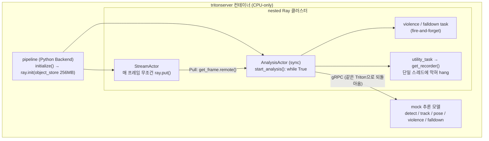
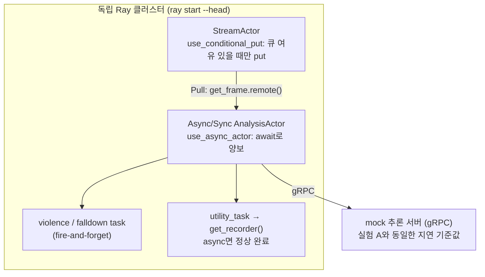
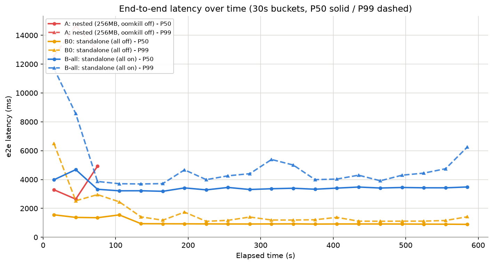
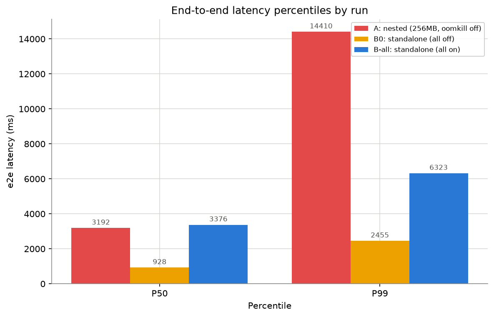
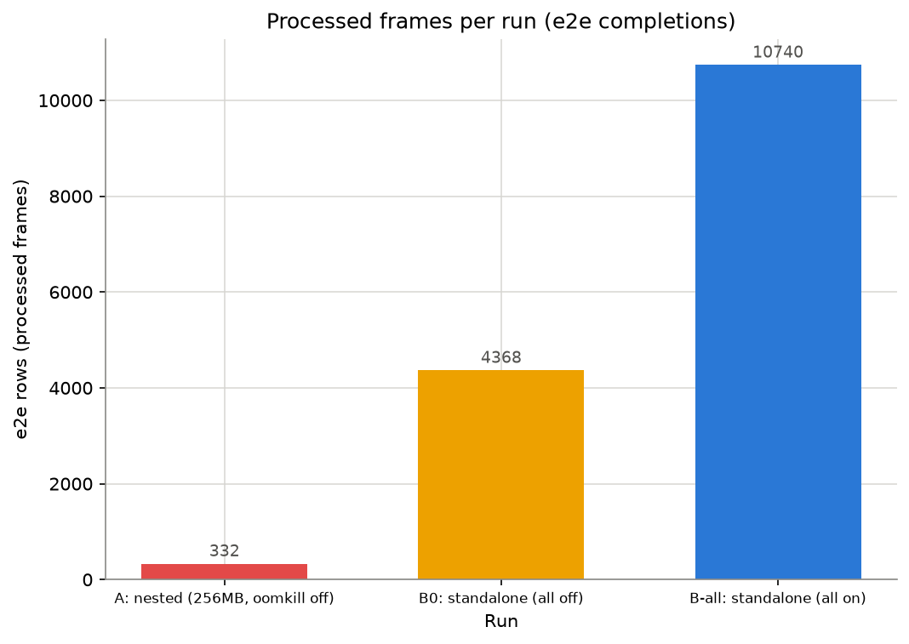
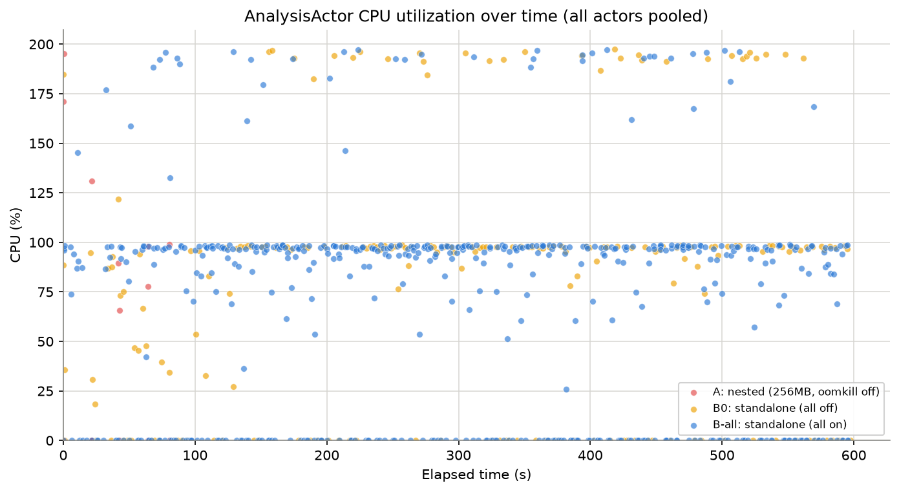
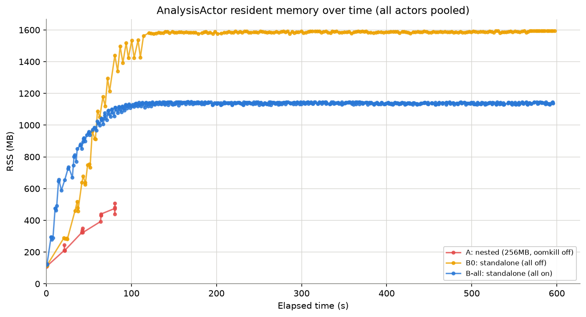

# Ray Nested vs Standalone 벤치마크

Triton Python Backend **안에서** Ray를 nested로 기동한 CCTV 분석 파이프라인의 성능 병목을
합성 워크로드로 재현하고, Ray를 독립(standalone)으로 분리했을 때의 개선 효과를 수치로 검증한다.

---

## 1. 요약

원 시스템은 실시간 CCTV 영상 분석 파이프라인이다. 분석 로직이 Triton Inference Server의 Python
Backend(Stub Process) 안에서 실행되고, **그 안에서 다시 Ray 클러스터를 초기화**하는 nested 구조다.
이 구조에서 부하가 오를수록 세 가지 현상이 나타났다.

1. end-to-end 지연이 지속 상승
2. 분석 Actor의 CPU가 주기적으로 0%로 낙하
3. Ray Object Spilling 누적

이 레포는 두 실험으로 원인을 분리한다.

- **실험 A (nested)**: 실제 tritonserver의 Python Backend 안에서 Ray를 기동해 원 구조를 그대로 재현.
- **실험 B (standalone)**: 동일 파이프라인을 독립 Ray 클러스터로 옮기고, 개선 항목 6종을 개별
  플래그로 켜고 끄며 기여도를 분해 측정.

핵심 결과: 동일 워크로드에서 **nested(A)는 약 86초 만에 계측 붕괴로 측정 종단**.
**standalone은 개선 이전(B0)에도 600초 완주**. 개선 6종을 모두 켠 B-all은 spill 로그
122건 → 5건, 처리 프레임 수 약 2.5배. (세부 지연 수치는 실측 자리표시자.)

---

## 2. 문제

원 시스템에서 식별한 12개 문제 중 성능에 직접 영향을 주는 8개가 재현 대상이다.
(상세 분석: [`docs/01-problem-analysis.md`](docs/01-problem-analysis.md))

| # | 범주 | 문제 | 심각도 |
|---|------|------|--------|
| 1 | 구조 | Stub + Ray 중첩 → CPU 경합/스케줄링 지연/캐시 오염/메모리 이중복사 | Critical |
| 2 | 구조 | Object Spilling → Memory Thrashing → 분석 Actor 기아 | Critical |
| 3 | 프레임 경로 | 매 프레임 Pull IPC (Raylet 왕복 2회) | High |
| 4 | 프레임 경로 | 버려지는 프레임도 ray.put() | Medium |
| 5 | 프레임 경로 | 직렬 동기 gRPC 3회 (의존성 체인) | High |
| 6 | 프레임 경로 | np.append() O(N) 재할당 | Medium |
| 7 | 이벤트 경로 | np.object_ SerDes → 대용량 pickle | High |
| 8 | 이벤트 경로 | get_recorder 태스크 기아 (무한 연기) | High |

문제 9~12는 코드 품질 이슈로 성능 벤치마크와 무관 — 범위 밖.

---

## 3. 가설

1. **문제 1은 Ray의 결함이 아니라 nested 구조의 결함이다.** Stub Process를 제거하고 Ray를
   standalone으로 기동하면 CPU 경합·캐시 오염·SHM↔Plasma 이중복사의 악순환이 함께 소멸한다.
2. **문제 2~8은 각각 독립적으로 개선 가능하다.** deque recorder, ObjectRef 저장, 조건부 put,
   async Actor, object_store 명시 설정을 플래그로 분해해 기여도를 측정할 수 있다.
3. **구조 전환과 개별 개선은 서로 다른 축이다.** 구조 전환(B0)이 붕괴를 막고, 개별 개선(B-all)이
   그 위에서 자원 낭비를 걷어내 처리량을 끌어올린다.

가설-실험 매핑: [`docs/02-experiment-design.md`](docs/02-experiment-design.md)

---

## 4. 설계 — A와 B에서 무엇이 같고 무엇이 다른가

두 실험은 파이프라인 스테이지·계측·추론 지연 기준값을 **동일 모듈에서 공유**한다.
다른 것은 Ray 기동 구조와 실험 B의 개선 플래그뿐이다.

### A → B에서 바꾼 것 (구조, 플래그와 무관)

| 항목 | A (nested) | B (standalone) |
|------|-----------|----------------|
| Ray 기동 위치 | Triton Python Backend의 `initialize()` 안에서 `ray.init()` | 독립 프로세스에서 `ray.init()` — Triton 부모 프로세스 자체가 없음 |
| 추론 호출 경로 | Actor가 자기가 사는 Triton으로 gRPC를 되돌려 호출 (self-loop) | 별도 프로세스의 mock 추론 gRPC 서버 호출 |

추론 지연 기준값은 동일 config를 쓰므로, 왕복 구조 외 변수는 없다.

### A → B에서 바꾸지 않은 것 (의도적 통제)

- StreamActor ↔ AnalysisActor 큐 구조: Pull 패턴(`get_frame.remote()`, 프레임당 Raylet 왕복
  2회), deque maxlen 15 그대로 유지. 큐 교체(push/Ray Queue 전환)는 플래그 효과를 격리하기
  위해 범위 밖.
- violence/falldown/utility 태스크, 프레임 생성기, 지연 기준값: nested 코드 재사용.

### 실험 A — nested 구조



이 구조에 원 시스템의 병목이 모두 담긴다: Triton self-loop gRPC, sync Actor의 무한 루프에 막혀
hang되는 `get_recorder`, 좁게 잡은 object_store로 유도되는 Spilling.

### 실험 B — standalone 구조



### 개선 플래그 6종 (전부 off = B0 = nested와 동일 로직, 전부 on = B-all)

| 플래그 | 대상 문제 | off (=A/B0 동작) | on (개선) |
|--------|----------|------------------|-----------|
| `use_conditional_put` | 4 | 소비 여부와 무관하게 매 프레임 `ray.put()` | 버퍼가 가득이면 put 자체를 생략 — 버려질 프레임의 Plasma 쓰기 비용 제거 |
| `use_deque_recorder` | 6 | recorder가 `np.append()`로 매번 O(N) 재할당 | `deque(maxlen)` O(1) |
| `use_objectref_recorder` | 7 | recorder에 프레임 원본 배열 저장 — 스냅샷 회수 시 전체 pickle | 이미지는 Plasma의 ObjectRef 그대로 두고 (timestamp, ref, track 결과)만 보관 — 직렬화가 경량 ref 단위로 축소 |
| `use_async_actor` | 8 | sync Actor가 `while True` 단일 메서드 점유 → `get_recorder` 무한 연기 | async Actor + await 양보 지점 → utility_task의 pull이 실행 기회 획득 |
| `explicit_object_store` | 2 | `ray.init()` 기본값 의존 | `object_store_memory` 명시 |
| `set_cpu_affinity` | (구조 가설) | OS 스케줄러 임의 배치 | 워커 프로세스를 코어에 고정 — 프로세스 전환 캐시 오염 억제 |

---

## 5. 결과

**구체적인 지연 수치(P50/P99 등)는 실측 자리표시자.** 아래에서 확정하는 것은 완주 여부·spill
로그 건수·상대 처리량처럼 실측으로 확인된 사실뿐이다. (상세: [`docs/03-results.md`](docs/03-results.md))

| 지표 | A (nested) | B0 (standalone) | B-all (standalone) |
|------|-----------|-----------------|--------------------|
| 완주 여부 | 약 86초 측정 종단 | 600초 완주 | 600초 완주 |
| e2e P50 | 3.2s → 4.9s 상승 후 종단 | *(실측 기입)* | *(실측 기입)* |
| e2e P99 | *(실측 기입)* | *(실측 기입)* | *(실측 기입)* |
| 분석 Actor CPU | 샘플 60%가 <1% | *(실측 기입)* | *(실측 기입)* |
| spill 로그 건수 | 다수 | 122건 | 5건 |
| 처리 프레임 수 (상대) | — | 1.0× (기준) | 약 2.5× |

<!-- TODO: 작업자 실측 기입 — 위 표의 *(실측 기입)* 칸을 docs/data/ CSV로 채운다 -->

### 그래프가 보여주는 것

**e2e 지연 타임라인 (30초 버킷 P50/P99)** — 프레임 생성부터 동기 분석 완료까지의 지연을 시간
축으로 그린 것. A는 초반부터 지연이 상승하다 86초 부근에서 선이 끊긴다(계측 붕괴). B0/B-all은
600초 내내 이어진다. "nested는 버티지 못하고 standalone은 버틴다"를 한 장으로 보여준다.



**e2e P50/P99 비교 막대** — 세 조건의 지연 분포 요약. A는 86초 관찰창 내 값이라 직접 비교 시
주의. B0 대비 B-all의 분포 변화가 개선 6종의 합산 효과다.



**처리 프레임 수 비교 막대** — 같은 시간 동안 각 조건이 처리를 끝낸 프레임 수. B-all이 B0의
약 2.5배 — 개선 플래그가 지연뿐 아니라 처리량을 끌어올렸음을 보여준다.



**분석 Actor CPU 타임라인** — 현상 2(CPU 0% 낙하)의 직접 증거. A에서는 CPU 샘플의 60%가
1% 미만(spill/직렬화에 막혀 연산을 못 하는 구간). B에서 이 낙하가 어떻게 달라지는지 비교.



**Actor RSS 추이** — 메모리 누적 패턴. recorder 누적·hang 태스크가 잡아둔 참조가 RSS 상승으로
나타난다. A의 급상승 후 붕괴 vs B의 평탄 유지가 대비 포인트.



---

## 6. 결론

- **구조 전환이 가장 큰 변수.** nested(A)는 86초 만에 측정 불능, standalone은 개선 이전(B0)에도
  600초 완주. 문제 1의 제거만으로 파이프라인이 붕괴에서 완주로 바뀌었다 — "Ray가 아니라 nested
  구조가 문제"라는 가설을 지지한다.
- **개별 개선은 그 위에서 여유를 만든다.** B0 → B-all에서 spill 로그 122건 → 5건, 처리 프레임
  수 약 2.5배.
- **재현 목표 달성.** 실험 A에서 원 시스템의 3대 현상(지연 지속 상승, 분석 Actor CPU 주기적
  낙하, Object Spilling)이 모두 관찰됐다.

---

## 7. Limitations & Future Work

### Limitations

- **단일 머신 WSL2 스케일다운**: 원 시스템의 다중 노드·대용량 RAM 서버 대신 로컬 WSL2 단일
  머신(6코어 / 11GB)에서 규모를 축소해 재현. 절대 수치는 이 환경에 종속된다.
- **mock 추론**: 실제 GPU 모델 대신 지연 기준값 기반 sleep + 크기 비례 busy-wait. 지연 기준값은
  원 시스템 로그 p50 근사치.
- **의도적 spill 유도**: 실험 A는 `object_store_memory`를 256MB로 좁게 잡아 Spilling을 조기
  유도했다. 원 서버의 대용량 조건에서 수 분~수십 분에 걸쳐 벌어질 현상을 짧은 관찰창으로 시간
  압축한 장치다.
- **문제 5의 재현 한계**: 직렬 gRPC의 처리량 병목은 프레임 간 배치로 개선 가능하지만, 배치
  최적화는 이 레포의 주제(구조 비교)가 아니다. 구조만 재현하고 개선은 측정하지 않았다.
- **실험 A는 약 86초 관찰창**: nested 구조는 계측을 포함한 시스템 전체가 열화되어 86초에 측정이
  종단됐다. A의 정량 지표는 이 짧은 창 안의 값이다.

### Future Work

- **프레임 간 배치**: 직렬 gRPC의 처리량/지연 트레이드오프를 배치 크기별로 측정.
- **대안 아키텍처 PoC**: asyncio 단일 프로세스, raw multiprocessing과 head-to-head 비교로
  "왜 Ray인가"를 정량 근거로 뒷받침. (배경: [`proposal.md`](proposal.md))
- **마이크로벤치**: SerDes 비용, ObjectRef 왕복 비용, ray.put() 빈도별 Spilling을 스테이지별로
  분리 측정.
- **플래그 개별 기여 분해**: 개선 6종을 하나씩만 켠 단일 플래그 매트릭스로 각 개선의 단독 기여를
  정량화.

---

## 실행 방법 (원커맨드)

```bash
# 뼈대 동작 확인
bash scripts/smoke.sh

# 모니터링 스택 (선택) — Prometheus:9090, Grafana:3000
bash scripts/start_monitoring.sh

# 실험 A (nested) — 기본은 Triton 본 측정 경로. 최초 실행 시 tritonserver 이미지(수 GB) pull
bash scripts/run_nested.sh
bash scripts/run_nested.sh --fallback   # Docker 불가 환경용 parent-process 경로

# 실험 B (standalone)
bash scripts/run_standalone.sh          # B0 (개선 플래그 전부 off)
bash scripts/run_standalone.sh --all-on # B-all (개선 6종 전부 on)
bash scripts/run_standalone.sh --use-async-actor   # 특정 플래그 하나만 on
```

결과 CSV는 `outputs/metrics.csv`에 기록된다.

## 요구사항

- Python 3.11+
- Docker & Docker Compose (monitoring 및 실험 A 본 측정 경로용. 불가 시 `--fallback`)
- 6 CPU cores / 8GB RAM 이상 (로컬 테스트 기준)
- 실험 A 본 측정 경로는 `nvcr.io/nvidia/tritonserver` 이미지(수 GB)를 최초 1회 내려받는다

## 저장소 구조

```
├── plan.md / research.md / proposal.md    # 실험 설계 · 원 시스템 분석 · 재설계 타당성
├── config/default.yaml                     # 모든 설정의 단일 소스
├── benchmark/
│   ├── common/                             # 공유 모듈 (config, frame 생성기, stages, mock_latency, metrics)
│   ├── nested/                             # 실험 A: nested Ray Actor + Docker 불가용 fallback
│   ├── standalone/                         # 실험 B: standalone Ray + 개선 플래그 6종
│   └── micro/                              # 마이크로벤치 (Future Work)
├── triton/                                 # 실험 A 본 측정 경로: tritonserver 모델 저장소
├── inference_mock/                         # gRPC 모의 추론 서버 (fallback / 실험 B 경로)
├── monitoring/                             # Prometheus + Grafana
├── scripts/                                # 원커맨드 실행 스크립트
├── analysis/                               # CSV → 그래프
└── docs/                                   # 01-problem-analysis · 02-experiment-design · 03-results
```
